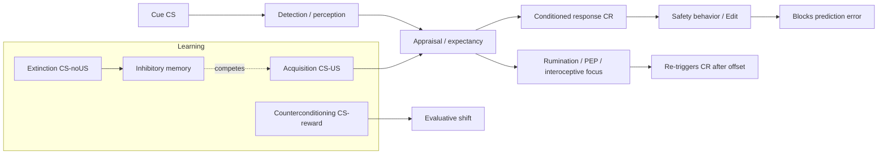

# Self-Telemetry and Alarm Calibration — Literature Synthesis

**Document type:** Character Architecture technique research (evidence-informed).  
**Brief (verbatim):** [PROMPT-self-telemetry-alarm-calibration-research.md](PROMPT-self-telemetry-alarm-calibration-research.md)  
**Architecture record (verbatim):** [progress-2026-09-27-self-telemetry-alarm-calibration.md](progress-2026-09-27-self-telemetry-alarm-calibration.md)  
**Standard:** Investigative, not confirmatory. Contradictions and null findings included.

---

## Executive Summary

No single clinical construct named “alarm calibration” exists. The closest validated cluster is **Pavlovian fear learning plus extinction / inhibitory learning**, applied clinically as **exposure-based therapy** (especially **Cognitive Therapy for Social Anxiety Disorder [CT-SAD]**, which targets self-focused attention and **safety behaviors**). The architecture’s **detection ≠ alarm** split is well supported: **accurate cue detection can coexist with miscalibrated autonomic and evaluative responses**, and treatment aims to **add competing safety/informational learning**, not blunt perception.

**Self-telemetry** partially maps onto **interoceptive awareness**, **anxiety sensitivity**, and **metacognitive monitoring** (S-REF / metacognitive therapy), but is broader: it explicitly includes **decoding inherited meaning** and **calibrating termination**, not only noticing sensations.

No one technique fully matches the Prime-state target (automatic rewrite without ongoing heroic reinterpretation). The best-supported path is **repeated expectancy-violating exposure without safety behaviors**, optionally augmented by **counterconditioning** (positive informational value) and **attention refocusing** (outward reward loop). **Alarm termination** is under-studied as a standalone target; clinically it is addressed via **post-event processing reduction**, **extinction/context cues**, and **stopping rumination that reactivates the CS**.

---

## 1. Best Scientific Match

| Architecture term | Nearest established constructs | Notes |
|---|---|---|
| **Alarm calibration** | Fear **extinction**; **inhibitory learning** (CS–noUS); **threat expectancy updating**; **emotional processing** (Foa & Kozak fear “structure” updating) | Extinction does not erase CS–US; it adds retrievable inhibition (Bouton; Craske et al.). |
| **Trigger threshold** | **Attention bias** to threat; **stimulus generalization**; **anxiety sensitivity**; **interoceptive conditioning** | Lowering threshold ≠ desirable globally; goal is **context-appropriate** triggering. |
| **Response intensity** | **Autonomic reactivity**; **anxiety sensitivity**; **fear potentiation** | Exposure + IL targets **US expectancy** and behavior more than raw habituation. |
| **Interpretation** | **Catastrophic misinterpretation** (panic/somatic); **social threat beliefs** (Clark–Wells); **appraisal** / **reappraisal** | Propositional “I know I’m safe” can diverge from associative learning (APE model; dual-process accounts). |
| **Persistence** | **Post-event processing**; **rumination**; **sustained autonomic activation** after offset | Social parallel to bug scenario’s **post-resolution symptoms**. |
| **Termination** | **Extinction retrieval**; **safety signals**; **context gating** (Bouton); **offset learning** (under-researched clinically) | “Event over” = need **retrieval of inhibition** + stop **re-activation** (rumination, re-appraisal loops). |
| **Reclassification / positive valence** | **Counterconditioning** (CS–appetitive US); **evaluative conditioning** | Mixed on **expectancy** vs **valence**; stronger for **liking/approach** than all fear metrics. |
| **Rewriting (Prime)** | **Inhibitory learning consolidation**; possible **retrieval-extinction / reconsolidation** (contested) | “Rewiring” is often **marketing**; demonstrated change is **new memory traces + retrieval competition**, not amygdala deletion. |
| **Self-telemetry** | **Interoceptive awareness**; **metacognitive monitoring**; **decentering/defusion** (ACT); **anxiety sensitivity** as transdiagnostic target | Instrumentation metaphor fits **metacognitive** and **interoceptive exposure** more than generic mindfulness. |

**Fields that map most directly:** learning theory (Pavlovian conditioning, extinction, inhibitory learning), **CT-SAD** maintenance model, **interoceptive exposure**, **counterconditioning** literature, **metacognitive therapy** (attention + beliefs about cognition).

**Where the framing may be wrong or over-unified:**

- **Trigger threshold, intensity, persistence, and termination** are partially **dissociable** in theory but **co-trained** in most protocols (exposure bundles them).
- **Positive revaluation** is not reliably achieved by extinction alone; **evaluative learning** can persist when **expectancy** falls (Hermans et al.; Dirikx et al., cited in counterconditioning renewal work).
- **Prime** as “no intercept needed” is consistent with **automatic emotion regulation** after extensive practice (implementation intentions, repeated exposure), but evidence for **domain-general** Prime is weak; learning is **cue- and context-specific**.

---

## 2. Mechanism Map — How Automatic Alarm Learning Works

**Acquisition:** Pairings (or inferred pairings) build **CS–US expectancy** and **S-R habits** (automatic bodily responses). Social evaluation fears combine **observational learning**, **verbal rules**, and **interoceptive conditioning** (internal sensations as CS).

**Expression vs knowledge:** Explicit safety beliefs update faster than **automatic** CRs (associative/propositional dissociation; Brewin’s dual representation for trauma is an extreme case: **verbally accessible** vs **situationally accessible** somatic engrams).

**Extinction (dominant clinical model):** Repeated **CS without US** creates **CS–noUS** learning that **inhibits** rather than erases CS–US (Bouton; Craske et al., 2014). **Retrieval competition** at test determines which memory wins.

**Inhibitory learning therapy (ILT):** Optimize **expectancy violation** (Rescorla–Wagner prediction error), not **within-session fear reduction**. End exposure on **learning**, not **calm** (Craske et al.; Deacon et al., 2013 for interoceptive exposure).

**Counterconditioning:** CS paired with **reward** can shift **valence** and approach, sometimes with **different neural pathways** (nucleus accumbens vs vmPFC extinction; eLife 2024 counterconditioning fMRI). Effects on **threat expectancy** are **protocol-dependent** (mixed replication).

**Maintenance traps:**

- **Safety behaviors** (including **The Edit**) prevent disconfirmation → preserve threat beliefs (Clark & Wells; McManus et al., 2008).
- **Self-focused attention** amplifies somatic cues and **post-event processing** → extends alarm past offset (Clark–Wells model).
- **Context change** → **renewal**; time → **spontaneous recovery**; unsignaled aversive event → **reinstatement**.

**Detection accuracy preserved:** Interoceptive and in vivo exposure explicitly train **tolerating accurate detection** while updating **meaning and response** (Clark, 1986; CCI interoceptive conditioning module).

---

## 3. Techniques Ranked by Relevance to Alarm Calibration

Rank = directness for *disproportionate / persistent automatic alarm with accurate detection*, not popularity.

| Rank | Technique | Primary alarm components targeted |
|---|---|---|
| 1 | **Exposure + inhibitory learning** (expectancy violation, varied contexts, no safety behaviors) | Expectancy, intensity, persistence, partial termination |
| 2 | **Safety behavior detection & dropping** (CT-SAD behavioral experiments) | Interpretation, intensity, blocks learning if kept |
| 3 | **Interoceptive exposure (IL-optimized)** | Intensity, interpretation, termination after somatic offset |
| 4 | **Situational attentional refocusing + external focus experiments** | Trigger (via attention), intensity, outwardness loop |
| 5 | **Counterconditioning / reward pairing with feared cue** | Valence, approach, asymmetry-seeking |
| 6 | **Post-event processing (PEP) interventions** | Persistence, termination after social “offset” |
| 7 | **Behavioral experiments (prediction testing)** | Interpretation, expectancy |
| 8 | **Metacognitive defusion / “thoughts as events”** (MCT/ACT subset) | Interpretation, signal ≠ command |
| 9 | **Implementation-intention reappraisal** (practice → automaticity) | Interpretation with lower effort; limited autonomic evidence |
| 10 | **Attention Training Technique (ATT)** | Attention flexibility; mixed as standalone for SAD |
| 11 | **Retrieval-extinction / reconsolidation protocols** | Potential “rewrite”; **replication unstable** |
| 12 | **HRV biofeedback (resonance breathing)** | State regulation; **weak specific CS recalibration** |
| 13 | **Generic mindfulness / breathing to reduce anxiety during exposure** | Risk of **safety behavior** if used to **avoid PE** |

---

## 4. Technique Cards

### 4.1 Inhibitory-Learning Exposure (Expectancy Violation)

| Field | Detail |
|---|---|
| **Target** | Interpretation, intensity, persistence; indirectly threshold via generalization |
| **Mechanism** | CS–noUS inhibitory memory; maximized **prediction error** when feared outcome absent or “manageable” |
| **Protocol** | (1) Elicit **specific prediction** (probability + severity). (2) Enter cue/situation **without US**, **without safety behaviors**. (3) Stay long/intense enough to violate prediction. (4) Post-trial: what was predicted vs occurred; **surprise** rating. (5) Repeat across **contexts**. |
| **Dose** | CT-SAD: typically **weekly sessions + daily homework** over **~14–16 weeks** (Clark et al. trials); fear-conditioning lab: **single-day** extinction with delayed test. |
| **Evidence** | **Strong** for anxiety disorders as a class; ILT refinements **moderate–strong** (Craske et al., 2014; Deacon et al., 2013). |
| **Time scale** | Symptom change **weeks**; automatic CR reduction **across repeated sessions**, not necessarily session 1. |
| **Generalization** | Improved by **multiple contexts**, **deepened violations**, avoiding **context-only** extinction learning; still **imperfect** (renewal literature). |
| **Failure modes** | Hidden safety behaviors; **too-short** exposures; **wrong prediction** targeted; **insufficient violation** (“I knew nothing would happen”). |
| **Relapse** | Renewal (context), spontaneous recovery (time), reinstatement (stress/aversive event). |
| **Architecture fit** | Core **alarm calibration**; supports **consequence intelligence** (test real US); opposes **The Edit** as safety behavior; enables **outwardness** when paired with external tasks. |

### 4.2 CT-SAD: Self-Focus vs External Focus + Drop Safety Behaviors

| Field | Detail |
|---|---|
| **Target** | Attentional capture, intensity, interpretation, safety behavior |
| **Mechanism** | Self-focus maintains distorted **social self-image**; safety behaviors prevent **disconfirming** evidence |
| **Protocol** | Two matched conversations: (A) **self-focus + safety behaviors**; (B) **external focus + drop behaviors**; compare anxiety and perceived performance. Then **video feedback** to correct distortions. Integrate into exposures. |
| **Evidence** | **Strong** for SAD (Clark & Wells; Warnock-Parkes et al.); experimental manipulation (McManus et al., 2008). |
| **Time scale** | **Immediate** within-session differences; trait change **weeks** of treatment. |
| **Generalization** | Requires **repeated** social shapes; video feedback aids **self-model** updating. |
| **Failure modes** | Strategic behavior misclassified as safety behavior; dropping all regulation → collapse (need **discrimination**). |
| **Architecture fit** | Direct map to **The Edit**, **outwardness**, **asymmetry-seeking** (external data gathering). |

### 4.3 Interoceptive Exposure (Optimized for Inhibitory Learning)

| Field | Detail |
|---|---|
| **Target** | Intensity, interpretation, persistence (somatic loop), termination after sensation peaks |
| **Mechanism** | Extinction of **interoceptive CS–panic US** link; catastrophic misinterpretation disconfirmed |
| **Protocol** | Induce feared sensations (e.g., hyperventilation, spinning, straw breathing) **to end point**; record predictions; **no escape** until learning consolidated; IL: emphasize **violation** (“catastrophe did not occur”), not calm. |
| **Evidence** | **Strong** for panic; **moderate** transdiagnostically (UP module); IL optimization **moderate** (Deacon et al., 2013). |
| **Time scale** | **Sessions to weeks**; bug-like **post-offset** symptoms may fade with **repeated offset without US**. |
| **Generalization** | Train **multiple** sensation types; link to **real-world** triggers (car, buzz, etc.). |
| **Failure modes** | Stopping early; using breathing **only** to suppress (safety); over-monitoring body (**hypervigilance**). |
| **Architecture fit** | Canonical **bug alarm**; **self-telemetry** on somatic channel; preserves **detection**. |

### 4.4 Counterconditioning (Aversive-to-Appetitive)

| Field | Detail |
|---|---|
| **Target** | Valence, approach, potentially renewal (reduced CS ambiguity) |
| **Mechanism** | CS predicts **reward**; NAcc-mediated appetitive learning may compete with fear |
| **Protocol** | After acquisition or during “extinction,” pair CS with **meaningful reward** (money, mastery, curiosity payoff) — e.g., social cue → **information gained** is recorded and rated as useful. |
| **Evidence** | **Mixed**: valence/avoidance **moderate** (Hulsman et al., 2024; Kang et al., 2018); some **null** on expectancy vs extinction (Gatzounis et al., 2021; van Dis et al., 2019). PTSD augmentation **preliminary** (Translational Psychiatry 2026). |
| **Time scale** | **Hours–days** in lab; clinical **unknown**. |
| **Generalization** | May reduce **renewal in novel contexts** (allergy CS study, PMC10648400); not universal. |
| **Failure modes** | Reward too weak; CS still predicts threat in other contexts; **evaluative** vs **expectancy** dissociation. |
| **Architecture fit** | **Asymmetry-seeking** (“their perception is useful”); positive revaluation beyond neutrality. |

### 4.5 Situational Attentional Refocusing (SAR) / Attention Training

| Field | Detail |
|---|---|
| **Target** | Attentional capture, intensity (secondary), supports exposure |
| **Mechanism** | Reduce **fixed self-focus**; increase **flexible external processing** (S-REF) |
| **Protocol** | **ATT:** daily ~15 min auditory focus switching (not in-situ). **SAR:** during live social task, **task-focused** external attention (conversation content, environment). |
| **Evidence** | SAR + ATT in MCT **exploratory moderate** (n=24); ATT add-on to CBGT **mixed**; component study **preliminary**. |
| **Time scale** | **Days–weeks** practice. |
| **Generalization** | Must transfer to **live** situations (SAR > ATT alone for social). |
| **Failure modes** | ATT as **avoidance** of social exposure; external focus without **rewarding task** → empty outwardness. |
| **Architecture fit** | **Outwardness** loop; pair with **pattern/hypothesis tasks** (Jane model). |

### 4.6 Post-Event Processing (PEP) Targeted Intervention

| Field | Detail |
|---|---|
| **Target** | Persistence, termination, rumination reactivation |
| **Mechanism** | Stop **re-consolidating** social threat after offset; reduce memory bias |
| **Protocol** | After event: **bounded review** (10 min), **evidence vs perception**, then **stop**; cognitive restructuring or mindfulness **single-session** reduces PEP (moderate); rumination-focused CBT **stronger** when explicit (meta-analysis g≈0.83). |
| **Evidence** | **Moderate–strong** for reducing PEP; **high PEP slows** overall CBT gains (Beckham et al., 2010). |
| **Time scale** | **Immediate** after events; trait PEP **weeks**. |
| **Architecture fit** | Social **alarm termination**; **tab closure**; prevents **Edit** rehearsal. |

### 4.7 Behavioral Experiments (Prediction Disconfirmation)

| Field | Detail |
|---|---|
| **Target** | Interpretation, expectancy |
| **Mechanism** | Propositional + experiential belief update; enables PE for extinction |
| **Protocol** | Identify belief → design **test** → predict → act **without safety behaviors** → review. |
| **Evidence** | **Strong** within CBT packages; standalone **moderate**. |
| **Architecture fit** | **Consequence intelligence**; **self-telemetry** as hypothesis testing. |

### 4.8 Metacognitive Defusion / “Cognition Is Not Reality”

| Field | Detail |
|---|---|
| **Target** | Interpretation; reduces obedience to signal |
| **Mechanism** | Metacognitive beliefs about ** uncontrollability/danger of thoughts**; decentering |
| **Protocol** | Detect thought/sensation → label as **event in mind/body** → defer action; MCT **detached mindfulness** variant. |
| **Evidence** | MCT for SAD **moderate** (trials smaller than CT-SAD); ACT defusion **moderate** component evidence. |
| **Automaticity** | Mostly **Intermediary** skill unless overlearned. |
| **Architecture fit** | **Self-telemetry** (“signal ≠ command”); risk if replaces **PE** (intellectual only). |

### 4.9 Implementation-Intention Reappraisal

| Field | Detail |
|---|---|
| **Target** | Interpretation with lower cognitive effort |
| **Mechanism** | Cue-linked automatic reappraisal (IF–THEN plans) |
| **Protocol** | “If I see X, then I will interpret as pixels / information.” Practice until automatic (ERP LPP effects). |
| **Evidence** | **Preliminary–moderate** for lab emotion; **limited** clinical disorder trials. |
| **Architecture fit** | Bridge **Intermediary → Prime** for specific cues. |

### 4.10 HRV Biofeedback (Resonance-Frequency Breathing)

| Field | Detail |
|---|---|
| **Target** | Response intensity (state), recovery |
| **Mechanism** | Increases vagal tone via ~6 breaths/min; **conscious** regulation |
| **Protocol** | Daily **~20 min** breathing at resonance frequency with HRV display. |
| **Evidence** | Meta-analysis **moderate** self-report anxiety (g≈0.8) vs controls; **limited** evidence for **cue-specific** extinction. |
| **Failure mode** | Used **during** exposure to **eliminate** feelings → **safety behavior** blocking PE. |
| **Architecture fit** | **State regulation**, not full **alarm rewrite**; may support **recovery after true alarms**. |

### 4.11 Retrieval-Extinction / Reconsolidation Interventions

| Field | Detail |
|---|---|
| **Target** | Rewriting, renewal (claimed) |
| **Mechanism** | CS reactivation + PE → labile memory → update with extinction or propranolol |
| **Evidence** | **Mixed / weak for clinical translation**; multiple **failed replications**; boundary conditions (PE magnitude, memory strength) **finicky** (Scientific Reports 2022; Frontiers 2017). |
| **Architecture fit** | Theoretically matches **Prime**; empirically **not ready** as first-line technique. |

---

## 5. What Changes Automaticity vs What Only Tolerates Alarms

| Changes future automatic responding (with repetition) | Mainly state / effortful regulation |
|---|---|
| Extinction / IL exposure without safety behaviors | Acute relaxation breathing during threat |
| Interoceptive exposure (somatic CS) | Generic “stay calm” self-talk without PE |
| Dropping safety behaviors + external focus (social) | Rumination without disconfirmation |
| Counterconditioning (valence/approach, some protocols) | ATT practiced only away from triggers |
| Implementation-intention reappraisal (cue-specific) | HRV biofeedback (unless not used as safety) |
| Some retrieval-extinction (lab, conditional) | Intellectual reappraisal alone |

**Key dissociation:** **Propositional safety** can update while **SCR/startle/facial blushing** remains (dual-process / implicit measures). **Behavioral experiments + exposure** are the main bridge to **automatic** change.

---

## 6. Alarm Termination (“The Event Is Over”)

**Scientific status:** Termination is not a widely named clinical module. Mechanistically it decomposes into:

1. **Offset learning:** US absent **continued** long enough (rate expectancy: CS duration in extinction ≥ acquisition; Gallistel & Gibbon, cited in ILT).
2. **Inhibitory retrieval at offset:** Context must **retrieve** CS–noUS, not CS–US (Bouton **occasion setting**).
3. **Stop post-offset reactivation:** **Post-event processing** and interoceptive **hypervigilance** re-trigger the program after the social or somatic event ends — parallel to **post-bug** symptoms when threat is gone.

**Evidence-informed practices:**

- **Explicit “threat over” consolidation:** After resolution (bug gone, conversation ended), brief **retrieval of outcome**: “Cue occurred; consequence did not; program complete.” Mirrors IL **post-exposure review** (not prolonged analysis).
- **Extinction-cue research (operant):** Pairing a **tone with extinction** reduced **spontaneous recovery / reinstatement** in animals (Brooks & Bouton; Sciencedirect extinction-cue paper) — suggests **learned “safe-to-stop” signals** are possible; human clinical translation **preliminary**.
- **PEP curtailment:** Bounded debrief; **no** extended self-audition (social termination).
- **Parasympathetic recovery:** Not the same as **extinction**; recovery can lag while **learning** is already updated — bug scenario may need **repeated offset trials** without re-escape.

**Gap:** Few RCTs isolate **termination training** from full exposure. Architecture correctly flags this as a **distinct variable**.

---

## 7. Positive Revaluation (Beyond Neutral)

- **Counterconditioning** best matches **“useful / rewarding information.”** Reduces **negative valence** and **costly avoidance** in approach–avoidance paradigms (Hulsman et al., 2024).
- **Standard extinction** reduces **expectancy** more reliably than **liking**; **evaluative learning** can **persist** and drive relapse (literature on evaluative conditioning vs expectancy extinction).
- **Asymmetry-seeking in therapy:** Frame exposures as **information-gathering missions** with **written payoff** (hypothesis confirmed/falsified) — clinically aligned with **behavioral experiments** and IL **surprise** focus; formal **reward pairing** is optional augmentation.
- **Curiosity / mastery:** Mechanistically overlap **reward prediction error** and **approach** learning; direct RCTs for social **judgment cues → curiosity** are sparse — inferred from counterconditioning + CT-SAD **external task engagement**.

**Contradiction to note:** Some counterconditioning studies show **no advantage** over extinction for **threat expectancy** at delay (Gatzounis et al., 2021) while still shifting **valence**.

---

## 8. Generalization and Relapse

| Phenomenon | Cause | Mitigation (evidence-informed) |
|---|---|---|
| **Renewal** | CS meaning **context-bound** | Expose in **multiple contexts**; carry **portable retrieval cues** for safety learning |
| **Spontaneous recovery** | Time favors old trace | **Booster** exposures; **extinction-cue** (animal); re-engage IL not just “remember therapy” |
| **Reinstatement** | Unsignaled aversive event | Stress management ≠ avoidance; **re-extinction** after stress |
| **Generalization failure** | Narrow CS training | **Stimulus generalization gradients** — train **variants** of cue (different gazes, bug sounds, tones) |
| **High PEP / rumination** | Re-encoding threat post-offset | Target PEP directly |

Systematic review (2024): clinical anxiety may impair **generalization of extinction**; subclinical traits show **mixed** effects.

---

## 9. What Not to Do (Maintains the Old Alarm)

| Practice | Why it backfires |
|---|---|
| **Safety behaviors / The Edit** | Prevents PE; attributes safety to edit not cue |
| **Calming rituals during exposure** | Can function as **safety**; blocks PE (unless explicitly framed as **post-alarm recovery**, not during cue) |
| **Body scanning for threat** | Increases **interoceptive salience** without updating meaning |
| **Avoidance of cue entirely** | No extinction |
| **Pure intellectual reappraisal** without behavior | Updates **proposition**, not **CR** |
| **Unbounded post-event rumination** | Reactivates CS–US **after offset** |
| **Exposure until “feel calm” only** | Habituation-focused; **weaker** long-term IL (Craske et al.) |
| **Forced positive thinking** without evidence | Not counterconditioning; no PE |

**When deliberate calming is a safety behavior:** When it is **contingent on the feared cue** and **prevents** experiencing **non-occurrence** of the feared outcome (e.g., breathing down blushing **before** learning whether rejection occurred).

**Does momentary anxiety reduction interfere with recalibration?** **If it prevents PE or maintains safety learning** — yes. **If it is after exposure** or **non-contingent** — less clear harm. Suppression during extinction: **mixed** (not superior to standard extinction in recent registered report).

---

## 10. Answers to Research Questions (XVIII)

1. **Closest concept to “alarm calibration”:** **Fear extinction / inhibitory learning** + **threat appraisal calibration** (clinical); not one word.

2. **Changes automatic responses:** Repeated **CS–noUS** exposure without safety behaviors; **interoceptive exposure**; **counterconditioning** (partial); **implementation intentions** (limited).

3. **Know safe, body alarms:** **Associative/propositional dissociation**; separate memory systems (dual representation extreme); **S-R** habits.

4. **Changes mismatch:** **Prediction error** during exposure; **drop safety behaviors**; **context-rich** extinction; possibly **counterconditioning** for valence.

5. **Trigger threshold:** **Attention bias modification** — weak/ inconsistent alone; **exposure generalization** reduces **false positives** for specific CS families; **not** global desensitization recommended.

6. **Reduce intensity without dulling perception:** **IL exposure**; **interoceptive** work; **not** anxiolytics in learning phase (not reviewed here).

7. **Shorten persistence:** **PEP interventions**; stop **rumination**; **offset consolidation** practices (hypothesis + animal extinction-cue data).

8. **Train termination:** **Post-offset review + stop**; **extinction duration**; **PEP**; research gap for standalone **“threat over”** training.

9. **Negative → positive valence:** **Counterconditioning** — **yes, often**; extinction alone — **neutral at best** for evaluative dimension.

10. **Curiosity / reward / mastery:** Via **counterconditioning** and **approach motivation**; direct social-curiosity trials limited.

11. **Prediction error:** Central to **ILT** and **reconsolidation** claims; magnitude must be **tuned** (too much → extinction not reconsolidation).

12. **Generalization limits:** **Context**, **CS similarity**, **comorbidity**, **PEP**, **evaluative persistence**.

13. **Relapse:** Renewal, spontaneous recovery, reinstatement; **extinction memory fragility** (mPFC engram silencing over time — animal work).

14. **Durable change:** **Multiple sessions**, **deep PE**, **multiple contexts**, **booster**; not single-session calm.

15. **Maintains alarm:** Safety behaviors, avoidance, rumination, wrong exposure target.

16. **Calming as safety:** When **cue-contingent** and blocks learning.

17. **Remove anxiety during exposure:** **Can interfere** if it prevents PE; **not** if used post-hoc.

18. **Outward attention:** Reduces **self-focused amplification** (Clark–Wells); **strong** within CT-SAD.

19. **Social-evaluative threat:** **CT-SAD** — **strong**; **VR exposure** moderate; **ABM** weak alone.

20. **Cross-domain generalization:** **Transdiagnostic** exposure principles **moderate**; **cue-specificity** remains; **interoceptive** + **social** require **both** channels trained.

---

## 11. Experimental Training Designs (Prototypes, Not Prescriptions)

### A. Bug cue (somatic / interoceptive)

**Hypothesis:** Accurate buzz detection can remain while **post-offset CR** extinguishes.

1. **Baseline week:** Log buzz → bodily response → action → **duration of symptoms after threat resolved** (termination metric).
2. **Interoceptive mapping:** Non-bug exercises that mimic **post-buzz** sensations (eyes/nose) **without** bug — IL predictions.
3. **In vivo hierarchy:** Recorded buzz → real benign bug in controlled setting → car scenario; **no escape** until **prediction violated** (“symptoms are tolerable; no catastrophe”).
4. **Offset protocol:** When bug exits, **60s** structured recap (“US absent”) then **mandatory external task** (no body scan).
5. **Counterconditioning variant:** Pair successful **locate-and-remove** with **pre-rated reward** (mastery score).
6. **Relapse test:** Different car / different insect sound; **renewal check**.

### B. Being watched

1. **Prediction sheet:** Who, what they’ll think, catastrophe probability.
2. **Contrast trials:** (A) self-focus + Edit; (B) external **observation task** (count colors, infer role) without Edit.
3. **Drop safety behaviors** in graded public settings.
4. **PEP limit:** 10-minute debrief timer after event.

### C. Social evaluation (“brute / repulsive”)

1. **Information frame:** Pre-commit **questions** their judgment answers (category, expectation, fear).
2. **Behavioral experiment:** Seek **disconfirming** or **useful** data without **confession fishing**.
3. **Counterconditioning:** Rate **information value** 0–10 after cue; reward = insight logged.
4. **Optional:** Exposures where **negative judgment is likely** but **consequence US absent**.

### D. Relationship tension (hostile / constraining person enters room)

1. **Self-telemetry:** Body activation logged as **data** (not command).
2. **Decode:** Uncertainty vs power vs history.
3. **Exposure:** Planned contact with **external strategic task**; **no** preemptive appeasement (safety).
4. **Termination:** After leaving room, **no replay** beyond bounded notes.

**Common metrics across prototypes:** US expectancy (0–100), **symptom duration after offset**, safety behavior checklist, **external task performance**, **surprise** rating.

---

## 12. Predictive Processing / Interoception (Careful Summary)

- **Established:** Expectations shape **interoceptive** experience and **autonomic** responses; **misinterpretation** maintains panic (Clark, 1986).
- **Theoretical:** Active inference frames anxiety as **high-precision threat priors** — useful metaphor for **alarm miscalibration**, but **clinical protocols** still map primarily to **CBT/exposure**, not separate “precision training” RCTs.
- **Self-telemetry fit:** Treat interoception as **noisy instrumentation** requiring **calibration against outcomes**, not silence.

---

## 13. What Remains Unknown

- **Standalone termination training** RCTs (event-over learning).
- **Positive revaluation** for **social judgment cues** without weakening **real threat detection**.
- **Prime state** as **default** without **context renewal** — likely **never fully context-free** in Bouton framework.
- **Combining** IL exposure + counterconditioning + SAR in one **factorial** trial for **Character-shaped** goals.
- **Individual differences:** Chronic thought suppression, anxiety sensitivity, PEP level as moderators.

---

## 14. Framing Verdict

| Architecture claim | Verdict |
|---|---|
| Detection ≠ alarm calibration | **Strong support** |
| Self-telemetry as foundation | **Plausible, partially validated** (interoception + metacognition + IL monitoring) |
| First technique domain = alarm calibration | **Aligned with exposure/inhibitory learning priority** |
| Neutral insufficient; useful → positive | **Supported for transition**; counterconditioning **mixed** |
| Safety behaviors ≈ The Edit | **Strong in social anxiety model** |
| Bug scenario as clean separation | **Excellent pedagogical case**; maps to **interoceptive conditioning + slow autonomic recovery** |
| Full automatic rewrite (Prime) without relapse | **Partially supported**; **relapse phenomena are normative** in learning theory |

**Nearest package for deliberate practice today:** **CT-SAD-style** (external focus, drop Edit, behavioral experiments, video/feedback where relevant) + **IL-optimized exposure** + **interoceptive work for somatic channels** + **PEP limits** + optional **counterconditioning** where **information/reward** is genuinely extracted.

---

## References (Entry Points)

- Craske MG, et al. (2014). Maximizing exposure therapy: an inhibitory learning approach. *Behaviour Research and Therapy.*
- Bouton ME. (1993, 2004). Context and time in extinction. *Psychological Review / Learning & Behavior.*
- Clark DM, Wells A. (1995). Cognitive model of social anxiety. In *Social Phobia.*
- McManus F, et al. (2008). Safety behaviours and self-focus in social anxiety. *Behaviour Research and Therapy.*
- Deacon BJ, et al. (2013). Optimizing interoceptive exposure for inhibitory learning. *Behaviour Research and Therapy.*
- Kang S, et al. (2018). Counterconditioning vs extinction. *Behaviour Research and Therapy.*
- Hulsman EP, et al. (2024). Counterconditioning and costly avoidance. *Preprint/lab series.*
- Wells A. (2000, 2007). Metacognitive therapy and ATT. *Clinical Psychology & Psychotherapy.*
- Beckham JC, et al. (2010). PEP and CBT for SAD. *Behaviour Research and Therapy.*
- Goessl VC, et al. (2017). HRV biofeedback meta-analysis. *Psychological Medicine.*
- Scientific Reports (2022). Reconsolidation boundary conditions replication failure.
- National Social Anxiety Center summary: Post-event processing (Clark–Wells lineage).

---

*End of synthesis. Update when new primary trials (especially counterconditioning in clinical SAD, extinction-cues in humans, termination-focused protocols) are published.*
